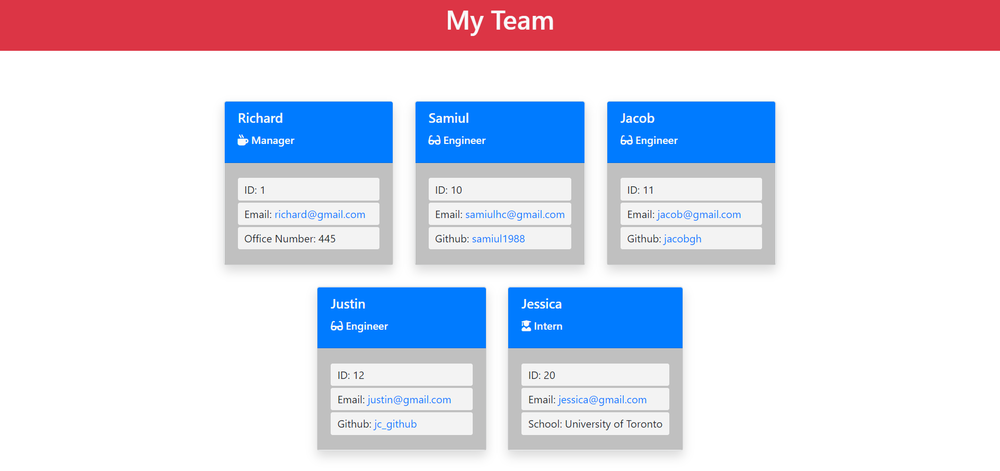

## Assignment 10: Team Profile Generator
---
### Topic
TDD and OOP (Constructors and Classes)

### User Story (Obtained from the assignment description)

```
AS A manager
I WANT to generate a webpage that displays my team's basic info
SO THAT I have quick access to their emails and GitHub profiles
```

### Acceptance Criteria (Obtained from the assignment description)

```
GIVEN a command-line application that accepts user input
WHEN I am prompted for my team members and their information
THEN an HTML file is generated that displays a nicely formatted team roster based on user input
WHEN I click on an email address in the HTML
THEN my default email program opens and populates the TO field of the email with the address
WHEN I click on the GitHub username
THEN that GitHub profile opens in a new tab
WHEN I start the application
THEN I am prompted to enter the team manager’s name, employee ID, email address, and office number
WHEN I enter the team manager’s name, employee ID, email address, and office number
THEN I am presented with a menu with the option to add an engineer or an intern or to finish building my team
WHEN I select the engineer option
THEN I am prompted to enter the engineer’s name, ID, email, and GitHub username, and I am taken back to the menu
WHEN I select the intern option
THEN I am prompted to enter the intern’s name, ID, email, and school, and I am taken back to the menu
WHEN I decide to finish building my team
THEN I exit the application, and the HTML is generated
```

## My Actions and Notes

* The project was developed from scratch.
* Basic considerations were as follows:
    * Used "input" prompt type for name, id, email, office number, github username and school name.
    * Used a "choice list" for selecting either an engineer or an intern or finishing the team building process.
    * Considered Employee ID and Office Number to be numeric only.  
    * The walkthrough video demonstrates couple of examples with different user inputs.
    * A sample HTML file generated using this application can be found in the "sample" folder.  

### Sample HTML file generated from this application
[Sample HTML File](./sample/team-profile.html)
#### Output Screenshot


### Demo Run


### Link of Walkthrough Video
The walkthrough video demonstrates the following:
* all four test suites passing
    * Due to time limitation, I ran all four tests together using ```npm test```
    * In the demo run shown in the previous section, I ran individual test as well as full test to show that individual components have also passed
* how a user would invoke the application from the command line
* how a user would enter responses to all of the prompts in the application
* a generated HTML file that matches the user input
    * when a Github link is clicked, it shows the asssociated github profile in a new tab
    * when an email is clicked, it opens the default email program and populates the TO field of the email with the address


[Click here to see the video](https://drive.google.com/file/d/1IM8kVVlVYrM2cALU0LDn-ewmJCiiwAD9/view)
